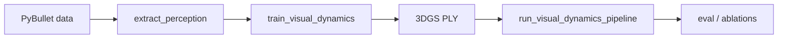

# Pipeline from scratch

**Authoritative spec:** [`../project.md`](../project.md)  
**All commands (copy-paste):** [`WORKFLOW_COMMANDS.md`](WORKFLOW_COMMANDS.md)

## Flow (high level)

| Phase | What | Where |
|-------|------|--------|
| 1 | 45 scenes, 10 cams, poses, RGB, masks | Local PyBullet |
| 2 | `states.npy`, `visual_feat_t0.npy` | Local or Modal `--extract-perception` |
| 3–4 | Transformer dynamics checkpoint | Modal `--train-visual-dynamics` |
| 5 | Rollout + warp 3DGS | Local or Modal `--visual-pipeline` |
| 6 | Horizon MSE, R², ablations | Local scripts |

Start with **[`WORKFLOW_COMMANDS.md`](WORKFLOW_COMMANDS.md)** §0–1 for data, then §“Recommended Modal path” for GPU steps.
