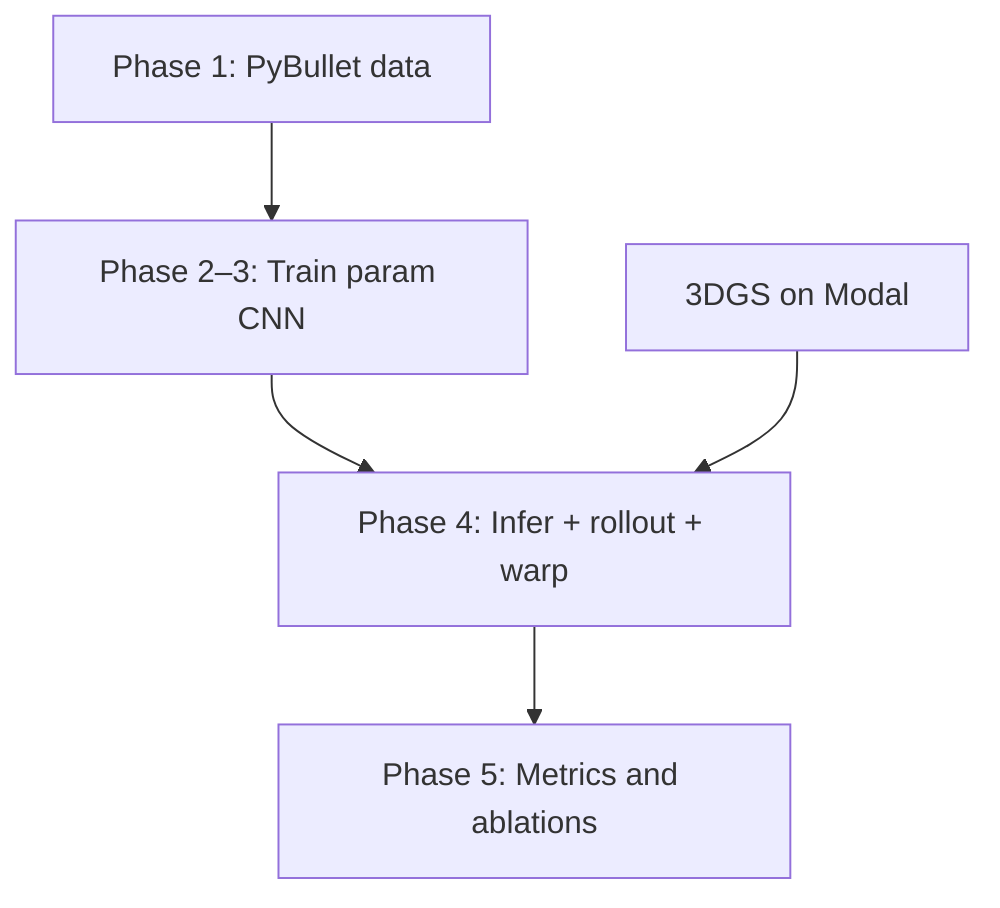

# Pipeline from scratch

End-to-end guide for the M2 **param-ID** path: multi-view video → CNN physics params → PyBullet rollout → warp 3D Gaussians → eval.

**Checklist:** [`PROJECT_CHECKLIST.md`](PROJECT_CHECKLIST.md)  
**What runs locally vs Modal:** [`modal_scripts.md`](modal_scripts.md)

---

## Prerequisites

```bash
cd /path/to/cs231n_project_phys4d
conda activate phys4d   # or a venv with the deps below
```

| Component | Install |
|-----------|---------|
| Local sim + training | `pip install -r requirements-m2.txt` (PyBullet, imageio, numpy&lt;2) |
| CNN training | `torch`, `torchvision` |
| Modal (GPU 3DGS / 4DGS / optional CNN) | `pip install -r requirements-modal.txt` then `modal setup` |

Sanity check:

```bash
python -m unittest tests/test_param_ident_shapes.py tests/test_restitution_recovery.py -q
```

---

## Overview



| Phase | Goal | Main artifacts |
|-------|------|----------------|
| 1 | Randomized bounces, K views, GT params | `outputs/.../rgb/`, `masks/`, `object_poses.csv`, manifest |
| 2–3 | CNN: video → (e, mass, drop_z) | `outputs/param_predictor/param_predictor_best.pt` |
| 4 | E2E demo | `outputs/param_id_pipeline/pipeline_report.json` |
| 5 | Paper metrics | param MSE, traj MSE, render PSNR (stretch) |

**v1 predicts:** restitution, mass_kg, drop_z_m (not friction).

---

## Phase 1 — Data

### 1a. Single scene (debug)

```bash
python scripts/generate_sphere_bounce_dataset.py
# → outputs/sphere_bounce_m2/{rgb,masks,object_poses.csv,physics_params.json}
```

### 1b. Many scenes (training set)

**Option 1 — new randomized set (target 150 scenes):**

```bash
python scripts/generate_param_id_batch.py --dry-run   # preview count
python scripts/generate_param_id_batch.py --limit 10  # smoke (~minutes)
# python scripts/generate_param_id_batch.py           # full 150 (hours)
```

Writes under `outputs/param_id_dataset/scene_XXXX_.../`.

**Option 2 — reuse existing grid batch (45 scenes):**

You already have `outputs/sphere_bounce_batch/` if you ran the older batch generator. Labels live in each scene’s `config.json`.

### 1c. Train / val / test split (80 / 10 / 10)

```bash
# New param_id_dataset:
python scripts/build_param_id_splits.py

# OR existing sphere_bounce_batch:
python scripts/build_param_id_splits.py \
  --batch-root outputs/sphere_bounce_batch \
  --out outputs/sphere_bounce_batch/dataset_manifest.json
```

Produces `dataset_manifest.json` with `batch_root` + `scene_id` entries.

---

## Phase 2–3 — Train param predictor

**Model:** ResNet18 per view → temporal Transformer → multi-view attention → 3 outputs.

### Local (GPU)

```bash
python scripts/train_param_predictor.py \
  --manifest outputs/sphere_bounce_batch/dataset_manifest.json \
  --data-root outputs \
  --epochs 50 \
  --batch-size 8 \
  --lr 1e-4 \
  --device cuda
```

For `param_id_dataset`, point `--manifest` at `outputs/param_id_dataset/dataset_manifest.json`.

**Outputs:**

- `outputs/param_predictor/param_predictor_best.pt`
- `outputs/param_predictor/param_predictor_last.pt`
- `outputs/param_predictor/train_history.json`

### Modal (GPU)

```bash
# Upload scenes (example: 45-scene batch)
modal volume put phys4d-gs-data outputs/sphere_bounce_batch sphere_bounce_batch

modal run modal_app.py --train-param-id \
  --param-id-manifest sphere_bounce_batch/dataset_manifest.json \
  --param-id-epochs 50

modal volume get phys4d-gs-output param_predictor outputs/param_predictor --force
```

---

## 3DGS substrate (for phase 4 warp)

Static 3DGS on **frame 0** of the demo scene (local sim data → Modal train).

```bash
# Local export (uses outputs/sphere_bounce_m2/rgb)
python scripts/export_gs_blender_scene.py --frame 0

modal run modal_app.py --upload
modal run modal_app.py --train
modal volume get phys4d-gs-output gs_sphere_bounce . --force
```

Expected PLY: `gs_sphere_bounce/point_cloud/iteration_7000/point_cloud.ply`

*(Optional)* Full-bounce **4DGS** for reconstruction demos:

```bash
python scripts/export_4dgs_dataset.py
modal run modal_app.py --upload-4d
modal run modal_app.py --train-4d
modal run modal_app.py --render-4d
```

---

## Phase 4 — End-to-end pipeline

**Script:** `scripts/run_param_id_pipeline.py`

Steps inside:

1. Load CNN checkpoint → predict params from multi-view video (frames 0–59).
2. PyBullet rollout with predicted params → `object_poses_predicted.csv`.
3. Select sphere Gaussians (mask filter @ ref frame).
4. Warp 3DGS to test frames → `warped_plys/`.
5. Mask-coverage proxy vs GT trajectory → `pipeline_report.json`.

### Local

```bash
python scripts/run_param_id_pipeline.py \
  --scene-dir outputs/sphere_bounce_m2 \
  --config configs/sphere_bounce_m2.json \
  --checkpoint outputs/param_predictor/param_predictor_best.pt \
  --ply gs_sphere_bounce/point_cloud/iteration_7000/point_cloud.ply \
  --gs-cameras gs_sphere_bounce/cameras.json \
  --out-dir outputs/param_id_pipeline \
  --device cuda
```

### Modal

```bash
modal run modal_app.py --upload-pipeline
# uploads: outputs/sphere_bounce_m2 → volume scene
#          gs_sphere_bounce + checkpoint if present locally

modal run modal_app.py --pipeline
modal volume get phys4d-gs-output param_id_pipeline outputs/param_id_pipeline --force
```

Read `outputs/param_id_pipeline/pipeline_report.json` for param errors, test-half z MSE, and mask coverage.

---

## Phase 5 — Evaluation (after E2E works)

| Metric | How |
|--------|-----|
| Param MSE | in `pipeline_report.json` or val loop in training |
| Trajectory MSE (frames 60–89) | `pipeline_report.json` → `trajectory_z_mse_test_half` |
| Render PSNR | `modal run modal_app.py --eval-4d` (4DGS) or future warped-3DGS render |
| Ablations | CNN vs state-only MLP; view-count sweep (TBD scripts) |

---

## Phase 6 — Real world (stretch)

Capture tabletop multi-phone video → run CNN + rollout → qualitative render (no GT params).

---

## Quick reference — copy/paste order

```bash
# 0) Env
conda activate phys4d

# 1) Data
python scripts/generate_sphere_bounce_dataset.py
python scripts/build_param_id_splits.py \
  --batch-root outputs/sphere_bounce_batch \
  --out outputs/sphere_bounce_batch/dataset_manifest.json
# OR: generate_param_id_batch.py + build_param_id_splits.py

# 2) Train CNN
python scripts/train_param_predictor.py \
  --manifest outputs/sphere_bounce_batch/dataset_manifest.json \
  --data-root outputs --epochs 50 --device cuda

# 3) 3DGS
python scripts/export_gs_blender_scene.py
modal run modal_app.py --upload && modal run modal_app.py --train
modal volume get phys4d-gs-output gs_sphere_bounce . --force

# 4) E2E
python scripts/run_param_id_pipeline.py
```

---

## Troubleshooting

| Symptom | Fix |
|---------|-----|
| `Missing manifest` | Run `build_param_id_splits.py` |
| `No scenes under batch_root` | Pass `--data-root outputs` (parent of `sphere_bounce_batch/`) |
| `Missing checkpoint` | Finish phase 2–3 training |
| `Missing 3DGS PLY` | Modal `--upload` + `--train`, download `gs_sphere_bounce` |
| Old batch has no `physics_params.json` | OK — splits script reads `config.json` |
| 6 vs 10 cameras | Training uses whatever `rgb/cam*` exist; regen data for K=10 |

---

## File map

```
configs/
  sphere_bounce_m2.json      # single-scene template
  param_id_dataset.json      # batch sampling manifest
outputs/
  sphere_bounce_m2/          # demo scene
  sphere_bounce_batch/        # multi-scene + dataset_manifest.json
  param_id_dataset/          # new randomized batch
  param_predictor/           # CNN checkpoints
  param_id_pipeline/         # phase 4 report + warped PLYs
gs_sphere_bounce/            # trained static 3DGS (from Modal)
scripts/
  generate_sphere_bounce_dataset.py
  generate_param_id_batch.py
  build_param_id_splits.py
  train_param_predictor.py
  run_param_id_pipeline.py
src/phys4d/param_ident/      # model + dataset + inference
modal_app.py                 # GPU jobs (--train-param-id, --pipeline, …)
```
